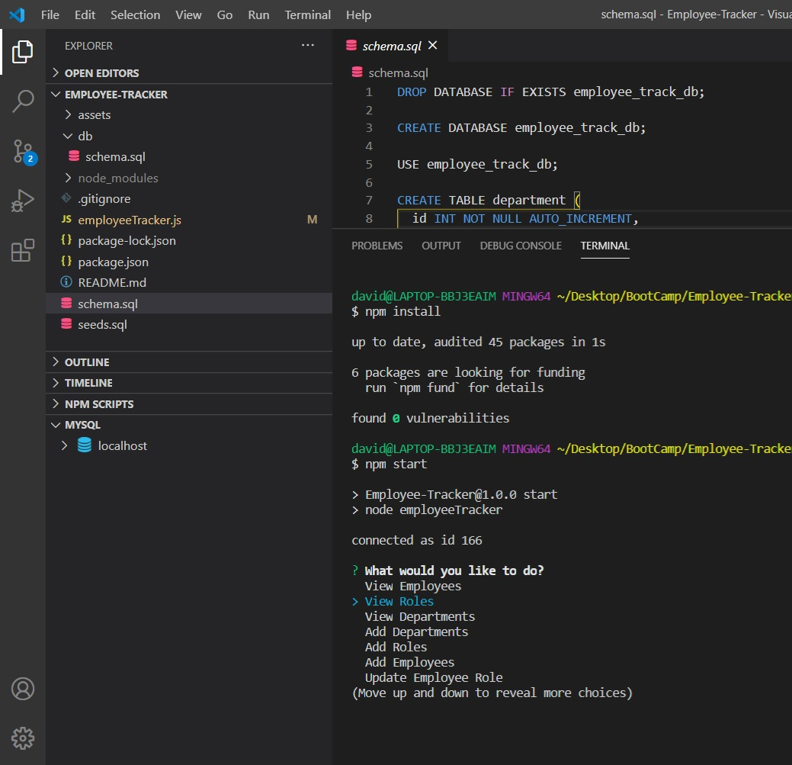
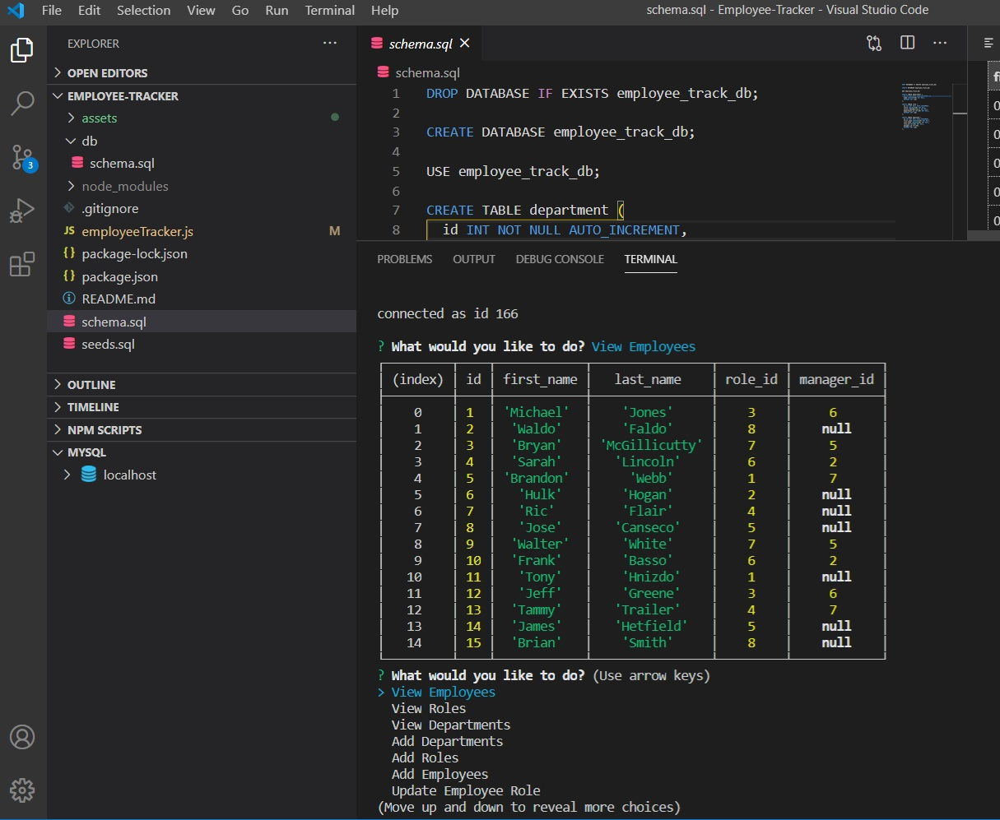

# Employee Tracker

### Table of Contents

* [Description](#Description)

* [Installation](#Installation)

* [Technologies](#Technologies)

* [Usage](##Usage)

* [Contributing](#Contributing)

* [Questions](#Questions)

* [Tests](#Tests)

* [Photos](#Photos)

* [Video](#Video)

## Description

A simple app that keeps track of the employees and what departments they work for. The Employees, Departments and Roles can all be updated.

## Installation Instructions

To install this project you will need to load all of the npm files that are dependencies and also the schema and seeds through mySQL. After that you run in the terminal and let the magic happen.

## Technologies Used

* NPM Inquirer
* SQL
* Youtube

## Usage

Please see the video for detailed instructions.

## Contributing

Email is the best contact method.

## Questions

I can be reached via Github or email, please see the appropriate links below.

Github:
<a href='https://github.com/daviddugle' target='_blank'>daviddugle</a>

Email:
<a href='mailto:david.dugleii@yahoo.com'>david.dugleii@yahoo.com</a>

## Tests

In Terminal

## Photos

## Video

